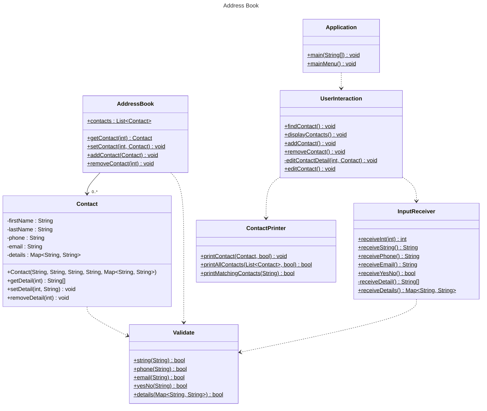

# Domain Models, Class Diagrams and Test Plan

## Class Diagram

## Test Plan

### User Story 1
#### Application.mainMenu()
 - [ ] Calls only UserInteraction.addContact() if InputReceiver.receiveInt() returns matching int

#### UserInteraction.addContact()
 - [ ] Calls AddressBook.addContact() with expected parameters if InputReceiver.receiveYesNo() returns true
 - [ ] Does not call AddressBook.addContact() with expected parameters if InputReceiver.receiveYesNo() returns false

#### Validate.string()
 - [ ] Returns false if string empty
 - [ ] Returns false if string only whitespace
 - [ ] Returns false if string null
 - [ ] Returns true if string valid

#### Validate.phone()
 - [ ] Returns false if string has non-numeric characters
 - [ ] Returns false if string empty
 - [ ] Returns false if string only whitespace
 - [ ] Returns false if string null
 - [ ] Returns true if string valid

#### Validate.email()
 - [ ] Returns false if string empty
 - [ ] Returns false if string only whitespace
 - [ ] Returns false if string has no at symbol
 - [ ] Returns false if string has no period
 - [ ] Returns false if string null
 - [ ] Returns true if string valid

#### Validate.yesNo()
 - [ ] Returns false if string [a-z] not 'y' or 'n'
 - [ ] Returns false if string more than one char
 - [ ] Returns false if string numeric
 - [ ] Returns false if string special character
 - [ ] Returns false if string empty
 - [ ] Returns false if string whitespace
 - [ ] Returns true if string valid

#### Validate.details()
 - [ ] Returns false if any String in map is empty
 - [ ] Returns false if any String in map is only whitespace
 - [ ] Returns false if any String in map is null
 - [ ] Returns false if map is null
 - [ ] Returns true if map contains valid entries
 - [ ] Returns true if map is empty

#### InputReceiver.receiveInt()
 - [ ] Throws error if cap negative
 - [ ] Retakes user input if outside of given range
 - [ ] Retakes user input if non-numeric
 - [ ] Retakes user input if empty
 - [ ] Retakes user input if only whitespace
 - [ ] Returns correct String if user input valid

#### InputReceiver.receiveString()
 - [ ] Retakes user input if empty
 - [ ] Retakes user input if only whitespace
 - [ ] Returns correct String if user input valid

#### InputReceiver.receivePhone()
 - [ ] Retakes user input if empty
 - [ ] Retakes user input if only whitespace
 - [ ] Retakes user input if non-numeric

#### InputReceiver.receiveEmail()
 - [ ] Retakes user input if empty
 - [ ] Retakes user input if only whitespace
 - [ ] Retakes user input if no at symbol
 - [ ] Retakes user input if no period

#### InputReceiver.receiveDetails()
 - [ ] Retakes user input if [a-z] not 'y' or 'n'
 - [ ] Retakes user input if more than one char
 - [ ] Retakes user input if numeric
 - [ ] Retakes user input if special character
 - [ ] Retakes user input if empty
 - [ ] Retakes user input if whitespace
 - [ ] Returns Map with correct elements if user input  lowercase y
 - [ ] Returns Map with correct elements if user input  uppercase Y
 - [ ] Returns empty map if user input  lowercase n
 - [ ] Returns empty map if user input uppercase N

#### AddressBook.addContact()
 - [ ] Throws error if firstName empty
 - [ ] Throws error if firstName only whitespace
 - [ ] Throws error if firstName null
 - [ ] Throws error if LastName empty
 - [ ] Throws error if LastName only whitespace
 - [ ] Throws error if LastName null
 - [ ] Throws error if phone empty
 - [ ] Throws error if phone only whitespace
 - [ ] Throws error if phone non-numeric
 - [ ] Throws error if phone null
 - [ ] Throws error if email empty
 - [ ] Throws error if email only whitespace
 - [ ] Throws error if email has no at symbol
 - [ ] Throws error if email has no period
 - [ ] Throws error if email null
 - [ ] Throws error if any String in details is empty
 - [ ] Throws error if any String in details is only whitespace
 - [ ] Throws error if any String in details is null
 - [ ] Throws error if details is null
 - [ ] Doesn't throw error if details is empty
 - [ ] Adds new Contact to contacts list if inputs valid

#### Contact Constructor
 - [ ] Throws error if firstName empty
 - [ ] Throws error if firstName only whitespace
 - [ ] Throws error if firstName null
 - [ ] Throws error if LastName empty
 - [ ] Throws error if LastName only whitespace
 - [ ] Throws error if LastName null
 - [ ] Throws error if phone empty
 - [ ] Throws error if phone only whitespace
 - [ ] Throws error if phone non-numeric
 - [ ] Throws error if phone null
 - [ ] Throws error if email empty
 - [ ] Throws error if email only whitespace
 - [ ] Throws error if email has no at symbol
 - [ ] Throws error if email has no period
 - [ ] Throws error if email null
 - [ ] Throws error if any String in details is empty
 - [ ] Throws error if any String in details is only whitespace
 - [ ] Throws error if any String in details is null
 - [ ] Throws error if details is null
 - [ ] Doesn't throw error if details is empty

### User Story 2
#### Application.mainMenu()
 - [ ] Calls only UserInteraction.displayContacts() if InputReceiver.receiveInt() returns matching int

#### UserInteraction.displayContacts()
 - [ ] Calls ContactPrinter.printAllContacts() with AddressBook.getContacts()

#### ContactPrinter.printAllContacts()
 - [ ] Throws error if contacts is null
 - [ ] Calls printContact() for each element in contacts

#### ContactPrinter.printContact()
 - [ ] Throws error if Contact is null
 - [ ] Prints contact correctly when no additional details
 - [ ] Prints contact correctly when at least one additional detail

### User Story 3
#### Application.mainMenu()
- [ ] Calls only UserInteraction.removeContact() if InputReceiver.receiveInt() returns matching int

#### UserInteraction.removeContact()
- [ ] Calls ContactPrinter.printAllContacts()
- [ ] Calls InputReceiver.receiveInt() with expected values
- [ ] Calls AddressBook.removeContact() with expected values

#### AddressBook.removeContact()
- [ ] Throws exception if index more than list size
- [ ] Throws exception if index less than 0
- [ ] Removes correct element from contacts

### User Story 4
#### Application.mainMenu()
 - [ ] Calls only UserInteraction.editContact() if InputReceiver.receiveInt() returns matching int

#### UserInteraction.editContact()
 - [ ] Does not call later methods if ContactPrinter.printAllContacts() returns false
 - [ ] Calls AddressBook.setContact() with correctly constructed Contact if second receiveInt() returns 0
 - [ ] Calls AddressBook.setContact() with correctly constructed Contact if second receiveInt() returns 1
 - [ ] Calls AddressBook.setContact() with correctly constructed Contact if second receiveInt() returns 2
 - [ ] Calls AddressBook.setContact() with correctly constructed Contact if second receiveInt() returns 3
 - [ ] Calls AddressBook.setContact() with correctly constructed Contact if second receiveInt() returns more than 3
 - [ ] Calls removeDetail() if InputReceiver.receiveYesNo() returns true
 - [ ] Calls setDetail() if InputReceiver.receiveYesNo() returns false
 - [ ] Calls AddressBook.setContact() with correctly constructed Contact

### User Story 5
#### Application.mainMenu()
 - [ ] Calls only UserInteraction.findContact() if InputReceiver.receiveInt() returns matching int

#### UserInteraction.findContact()
 - [ ] Does not call later methods if address book is empty
 - [ ] Calls ContactPrinter.printMatchingContacts()

#### ContactPrinter.printMatchingContacts()
 - [ ] Throws exception if name empty
 - [ ] Throws exception if name only whitespace
 - [ ] Throws exception if name null
 - [ ] Prints expected contacts if input matches one contact
 - [ ] Prints expected contacts if input matches some contacts
 - [ ] Prints no contacts if input does not match any contact
 - [ ] Prints expected contacts if input partially matches start of firstName
 - [ ] Prints expected contacts if input partially matches end of firstName
 - [ ] Prints expected contacts if input partially matches middle of firstName
 - [ ] Print expected contacts if input matches lastName

### User Story 6
#### UserInteraction.addContact()
 - [ ] Print confirmation message when contact is added to address book
 - [ ] Print confirmation message when process is cancelled

#### UserInteraction.removeContact()
 - [ ] Prints confirmation message when contact is removed

#### UserInteraction.editContact()
 - [ ] Calls ContactPrinter.printContact() after contact is updated

#### ContactPrinter.printAllContacts()
 - [ ] Print message if no contacts to print

#### ContactPrinter.printMatchingContacts
 - [ ] Print message if no contacts match input

### User Story 7
#### Application.mainMenu()
 - [ ] Exits program if InputReceiver.receiveInt() returns matching int