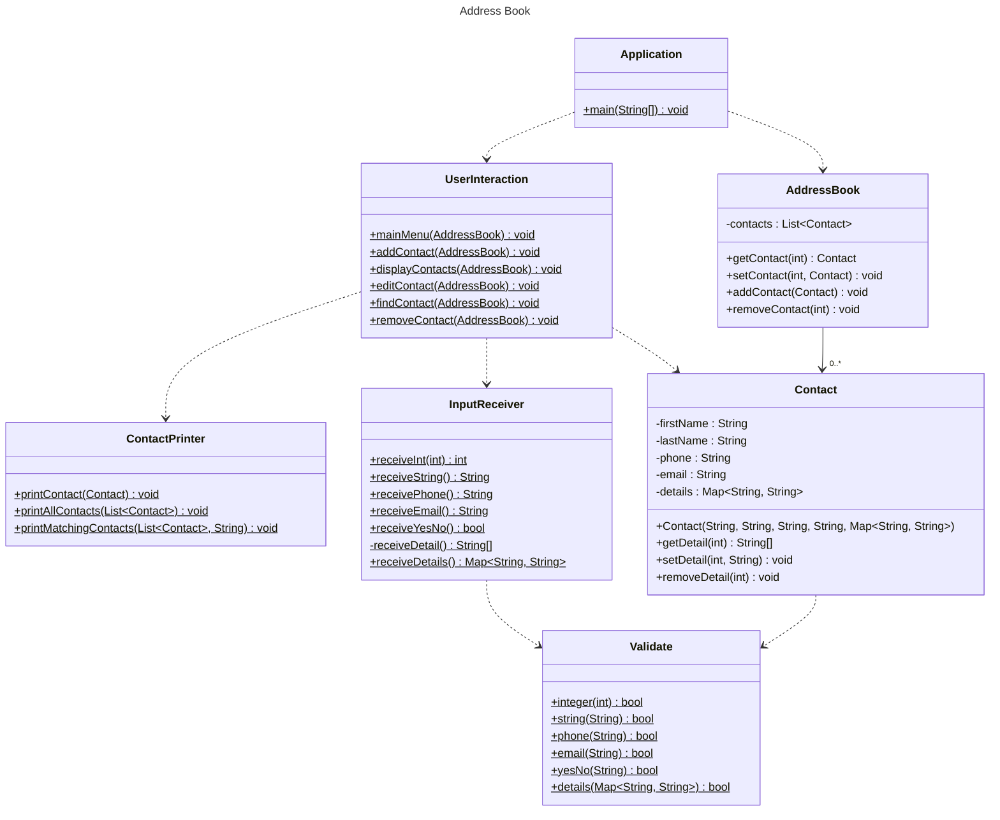

# Domain Models, Class Diagrams and Test Plan

## Class Diagram

## User Stories

### User Story 1
As a user, I want to add a contact to the address book, so I can remember their details

### User Story 2
As a user, I want to view the contacts in the address book, so I can look through all my contacts

### User Story 3
As a user, I want to be able to view contacts in pages, so that I do not get overwhelmed with information

### User Story 4
As a user, I want to edit a contacts details, so that I can fix mistakes and update details

### User Story 5
As a user, I want to find a contact by searching for it, so that I can find the contact I want

## Test Plan

### User Story 1
#### Application.main()
 - [x] Calls mainMenu()

#### UserInteraction.mainMenu()
 - [x] Doesn't call any method if InputReceiver.receiveInt() returns no matching int
 - [x] Only calls addContact() if InputReceiver.receiveInt() returns matching int

#### UserInteraction.addContact()
 - [x] Calls all expected methods in InputReceiver
 - [x] Calls Contact constructor with expected parameters
 - [x] Calls AddressBook.addContact()

#### InputReceiver.receiveInt()
 - [x] Throws error if cap negative
 - [x] Retakes user input if Validate.integer() returns false
 - [x] Retakes user input if input.nextInt() throws exception
 - [x] Returns correct int if Validate.integer() returns true and no exceptions thrown

#### InputReceiver.receiveString()
 - [x] Retakes user input if Validate.string() returns false
 - [x] Returns correct String if Validate.string() returns true

#### InputReceiver.receivePhone()
 - [x] Retakes user input if Validate.phone() returns false
 - [x] Retakes user input if matched existing contact phone
 - [x] Returns correct String if Validate.phone() returns true

#### InputReceiver.receiveEmail()
 - [x] Retakes user input if Validate.email() returns false
 - [x] Retakes user input if matched existing contact email
 - [x] Returns correct String if Validate.email() returns true

#### InputReceiver.receiveYesNo()
 - [x] Retakes user input if Validate.yesNo() returns false
 - [x] Accepts user input if Validate.yesNo() returns true
 - [x] Returns false if first character of input is not y
 - [x] Returns true if first character of input is lowercase y
 - [x] Returns true if first character of input is uppercase y
 - [x] Returns true if whitespace before y

#### InputReceiver.receiveDetail()
 - [x] Returns map with key value given by InputReceiver.receiveString() calls

#### InputReceiver.receiveDetails()
 - [x] Does not call InputReceiver.receiveDetail() if InputReceiver.yesNo() returns false
 - [x] Calls InputReceiver.receiveDetail() as many times as InputReceiver.yesNo() returns true
 - [x] Returns expected map

#### Validate.integer()
 - [x] Returns false if int less than 0
 - [x] Returns false if int more than cap
 - [x] Returns true if int valid
 - [x] Returns true if int 0 and cap 0

#### Validate.string()
 - [x] Returns false if string empty
 - [x] Returns false if string only whitespace
 - [x] Returns false if string null
 - [x] Returns true if string valid

#### Validate.phone()
 - [x] Returns false if string has non-numeric characters
 - [x] Returns false if string empty
 - [x] Returns false if string only whitespace
 - [x] Returns false if string null
 - [x] Returns true if string valid

#### Validate.email()
 - [x] Returns false if string has no @
 - [x] Returns false if string has no .
 - [x] Returns false if no text before @
 - [x] Returns false if no text after .
 - [x] Returns false if no text between @ and .
 - [x] Returns false if string empty
 - [x] Returns false if string only whitespace
 - [x] Returns false if string null
 - [x] Returns true if string valid

#### Validate.yesNo()
 - [x] Returns false if string not 'y' or 'n'
 - [x] Returns false if string more than one char
 - [x] Returns false if string numeric
 - [x] Returns false if string special character
 - [x] Returns false if string empty
 - [x] Returns false if string whitespace
 - [x] Returns false if string null
 - [x] Returns true if string 'y'
 - [x] Returns true if string 'n'

#### Validate.details()
 - [x] Returns false if any String in map is empty
 - [x] Returns false if any String in map is only whitespace
 - [x] Returns false if any String in map is null
 - [x] Returns false if map is null
 - [x] Returns true if map contains valid entries
 - [x] Returns true if map is empty

#### AddressBook.addContact()
 - [x] Throws error if Contact is null
 - [x] Adds new Contact to contacts list if inputs valid

#### Contact Constructor
 - [x] Throws exception if Validate.string returns false for firstName
 - [x] Throws exception if Validate.string returns false for lastName
 - [x] Throws exception if Validate.phone returns false for phone
 - [x] Throws exception if Validate.email returns false for email
 - [x] Throws exception if Validate.details returns false for details
 - [x] Does not throw exception if Validate methods all return true

### User Story 2
#### UserInteraction.mainMenu()
 - [x] Calls only displayContacts() if InputReceiver.receiveInt() returns matching int

#### UserInteraction.displayContacts()
 - [x] Calls ContactPrinter.printAllContacts() with list of contacts from addressBook

#### ContactPrinter.printAllContacts()
 - [x] Throws exception if List is null
 - [x] Calls printContact() for each element in contacts

#### ContactPrinter.printContact()
 - [x] Throws exception if Contact is null
 - [x] Prints contact correctly when no additional details
 - [x] Prints contact correctly with details

### User Story 3
#### UserInteraction.mainMenu()
 - [x] Calls only removeContact() if InputReceiver.receiveInt() returns matching int

#### UserInteraction.removeContact()
 - [x] Prints message if no contacts
 - [x] Calls ContactPrinter.printAllContacts()
 - [x] Calls AddressBook.removeContact() with return value of InputReceiver.receiveInt()

#### AddressBook.removeContact()
 - [x] Throws exception if index more than list size
 - [x] Throws exception if index less than 0
 - [x] Removes expected element from contacts

### User Story 4
#### UserInteraction.mainMenu()
 - [x] Calls only editContact() if InputReceiver.receiveInt() returns matching int

#### UserInteraction.editContact()
 - [x] Prints message if no contacts
 - [x] Calls ContactPrinter.printAllContacts()
 - [x] Calls ContactPrinter.printContact() with Contact chosen by InputReceiver.receiveInt() return value

#### UserInteraction.editContact(): Choose edit
 - [x] Calls Contact.setFirstName() with InputReceiver.receiveString() return value if InputReceiver.receiveInt() returns 0
 - [x] Calls Contact.setLastName() with InputReceiver.receiveString() return value if InputReceiver.receiveInt() returns 1
 - [x] Calls Contact.setPhone() with InputReceiver.receivePhone() return value if InputReceiver.receiveInt() returns 2
 - [x] Calls Contact.setEmail() with InputReceiver.receiveEmail() return value if InputReceiver.receiveInt() returns 3
 - [x] Calls InputReceiver.yesNo() if InputReceiver.receiveInt() returns 4

#### UserInteraction.editContact(): Edit Detail
 - [x] Calls Contact.addDetail with return of InputReceiver.receiveDetail() if first InputReceiver.yesNo() returns true
 - [x] Calls Contact.removeDetail() if second InputReceiver.receiveYesNo() returns true
 - [x] Calls Contact.setDetail() if second InputReceiver.receiveYesNo() returns false

### User Story 5
#### UserInteraction.mainMenu()
 - [x] Calls only findContact() if InputReceiver.receiveInt() returns matching int

#### UserInteraction.findContact()
 - [x] Prints message if no contacts
 - [x] Calls ContactPrinter.printMatchingContacts() with return of InputReceiver.receiveString()

#### ContactPrinter.printMatchingContacts()
 - [x] Throws exception if name empty
 - [x] Throws exception if name only whitespace
 - [x] Throws exception if name null
 - [x] Throws exception if contacts null
 - [x] Prints expected contacts if input matches one contact
 - [x] Prints expected contacts if input matches some contacts
 - [x] Prints no contacts if input does not match any contact
 - [x] Prints expected contacts if input partially matches start of firstName
 - [x] Prints expected contacts if input partially matches end of firstName
 - [x] Prints expected contacts if input partially matches middle of firstName
 - [x] Print expected contacts if input fully of partially matches lastName

### User Story 6
#### UserInteraction.mainMenu()
 - [x] Print message showing options

#### InputReceiver.receiveInt()
 - [x] Print message if input was invalid

#### UserInteraction.displayContacts()
 - [x] Print message if no contacts to print

#### UserInteraction.addContact()
 - [x] Prompts user for each input
 - [x] Confirm adding contact with user
 - [x] AddressBook.addContact() not called if user cancels
 - [x] Print confirmation message when contact is added to address book
 - [x] Print confirmation message when process is cancelled

#### InputReceiver.receiveString()
 - [x] Print message if input was invalid

#### InputReceiver.receivePhone()
 - [x] Print message if input was invalid

#### InputReceiver.receiveEmail()
 - [x] Print message if input was invalid

#### InputReceiver.receiveDetails()
 - [x] Print message asking if user wants to add detail
 - [x] Confirm adding detail
 - [x] Cancel adding detail

#### InputReceiver.receiveDetail()
 - [x] Prompts user for each input

#### InputReceiver.receiveYesNo()
 - [x] Print message if input was invalid

#### UserInteraction.removeContact()
 - [x] Prompt user for choice
 - [x] Prints confirmation message when contact is removed
 - [x] Prints confirmation message when canceled

#### ContactPrinter.printAllContacts()
 - [x] Print numbers for each contact

#### UserInteraction.editContact()
 - [x] Prompts choice of attribute to edit
 - [x] Prompts input for each default attribute
 - [x] Prompts user choice for detail removal and addition
 - [x] Prompt user choice for detail to remove
 - [x] Prompt user choice for detail to edit and value

#### UserInteraction.findContact()
 - [x] Prompt user to input search term

#### ContactPrinter.printMatchingContacts()
 - [x] Print message if no contacts found

### User Story 7
#### UserInteraction.mainMenu()
 - [x] Exits program if InputReceiver.receiveInt() returns matching int
 - [ ] Retakes user input if invalid or chosen method returns