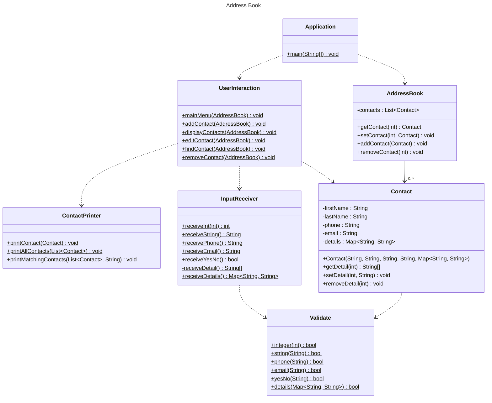

# Domain Models, Class Diagrams and Test Plan

## Class Diagram

## Test Plan

### User Story 1
#### Application.main()
 - [x] Calls mainMenu()

#### UserInteraction.mainMenu()
 - [x] Doesn't call addContact() if InputReceiver.receiveInt() returns unmatching int
 - [x] Only calls addContact() if InputReceiver.receiveInt() returns matching int

#### UserInteraction.addContact()
 - [x] Calls all expected methods in InputReceiver
 - [x] Calls Contact constructor with expected parameters
 - [x] Calls AddressBook.addContact()

#### InputReceiver.receiveInt()
 - [x] Throws error if cap negative
 - [x] Retakes user input if Validate.integer() returns false
 - [x] Retakes user input if input.nextInt() throws exception
 - [x] Returns correct int if Validate.integer() returns true and no exceptions thrown

#### InputReceiver.receiveString()
 - [x] Retakes user input if Validate.string() returns false
 - [x] Returns correct String if Validate.string() returns true

#### InputReceiver.receivePhone()
 - [x] Retakes user input if Validate.phone() returns false
 - [x] Returns correct String if Validate.phone() returns true

#### InputReceiver.receiveEmail()
 - [x] Retakes user input if Validate.email() returns false
 - [x] Returns correct String if Validate.email() returns true

#### InputReceiver.receiveYesNo()
 - [x] Retakes user input if Validate.yesNo() returns false
 - [x] Accepts user input if Validate.yesNo() returns true
 - [x] Returns false if first character of input is not y
 - [x] Returns true if first character of input is lowercase y
 - [x] Returns true if first character of input is uppercase y
 - [x] Returns true if whitespace before y

#### InputReceiver.receiveDetail()
 - [x] Returns map with key value given by InputReceiver.receiveString() calls

#### InputReceiver.receiveDetails()
 - [x] Does not call InputReceiver.receiveDetail() if InputReceiver.yesNo() returns false
 - [x] Calls InputReceiver.receiveDetail() as many times as InputReceiver.yesNo() returns true
 - [x] Returns expected map

#### Validate.integer()
 - [x] Returns false if int less than 0
 - [x] Returns false if int more than cap
 - [x] Returns true if int valid
 - [x] Returns true if int 0 and cap 0

#### Validate.string()
 - [x] Returns false if string empty
 - [x] Returns false if string only whitespace
 - [x] Returns false if string null
 - [x] Returns true if string valid

#### Validate.phone()
 - [x] Returns false if string has non-numeric characters
 - [x] Returns false if string empty
 - [x] Returns false if string only whitespace
 - [x] Returns false if string null
 - [x] Returns true if string valid

#### Validate.email()
 - [x] Returns false if string has no @
 - [x] Returns false if string has no .
 - [x] Returns false if no text before @
 - [x] Returns false if no text after .
 - [x] Returns false if no text between @ and .
 - [ ] Returns false if string empty
 - [ ] Returns false if string only whitespace
 - [ ] Returns false if string null
 - [ ] Returns true if string valid

#### Validate.yesNo()
 - [ ] Returns false if string [a-z] not 'y' or 'n'
 - [ ] Returns false if string more than one char
 - [ ] Returns false if string numeric
 - [ ] Returns false if string special character
 - [ ] Returns false if string empty
 - [ ] Returns false if string whitespace
 - [ ] Returns true if string valid

#### Validate.details()
 - [ ] Returns false if any String in map is empty
 - [ ] Returns false if any String in map is only whitespace
 - [ ] Returns false if any String in map is null
 - [ ] Returns false if map is null
 - [ ] Returns true if map contains valid entries
 - [ ] Returns true if map is empty

#### AddressBook.addContact()
 - [ ] Throws error if Contact is null
 - [ ] Adds new Contact to contacts list if inputs valid

#### Contact Constructor
 - [ ] Throws error if firstName empty
 - [ ] Throws error if firstName only whitespace
 - [ ] Throws error if firstName null
 - [ ] Throws error if LastName empty
 - [ ] Throws error if LastName only whitespace
 - [ ] Throws error if LastName null
 - [ ] Throws error if phone empty
 - [ ] Throws error if phone only whitespace
 - [ ] Throws error if phone non-numeric
 - [ ] Throws error if phone null
 - [ ] Throws error if email empty
 - [ ] Throws error if email only whitespace
 - [ ] Throws error if email has no at symbol
 - [ ] Throws error if email has no period
 - [ ] Throws error if email null
 - [ ] Throws error if any String in details is empty
 - [ ] Throws error if any String in details is only whitespace
 - [ ] Throws error if any String in details is null
 - [ ] Throws error if details is null
 - [ ] Doesn't throw error if details is empty

### User Story 2
#### UserInteraction.mainMenu()
 - [ ] Doesn't call displayContacts() if InputReceiver.receiveInt() returns unmatching int
 - [ ] Calls only displayContacts() if InputReceiver.receiveInt() returns matching int

#### UserInteraction.displayContacts()
 - [ ] Calls ContactPrinter.printAllContacts() with list of contacts from addressBook

#### ContactPrinter.printAllContacts()
 - [ ] Throws error if List is null
 - [ ] Calls printContact() for each element in contacts

#### ContactPrinter.printContact()
 - [ ] Throws error if Contact is null
 - [ ] Prints contact correctly when no additional details
 - [ ] Prints contact correctly when at least one additional detail

### User Story 3
#### UserInteraction.mainMenu()
 - [ ] Doesn't call removeContact() if InputReceiver.receiveInt() returns unmatching int
 - [ ] Calls only removeContact() if InputReceiver.receiveInt() returns matching int

#### UserInteraction.removeContact()
 - [ ] Does not call later methods if contacts list is empty
 - [ ] Calls ContactPrinter.printAllContacts()
 - [ ] Calls AddressBook.removeContact() with return value of InputReceiver.receiveInt()

#### AddressBook.removeContact()
 - [ ] Throws exception if index more than list size
 - [ ] Throws exception if index less than 0
 - [ ] Removes expected element from contacts

### User Story 4
#### UserInteraction.mainMenu()
 - [ ] Calls only editContact() if InputReceiver.receiveInt() returns matching int

#### UserInteraction.editContact()
 - [ ] Does not call later methods if contacts list is empty
 - [ ] Calls ContactPrinter.printAllContacts()
 - [ ] Calls ContactPrinter.printContact() with Contact chosen by InputReceiver.receiveInt() return value
 - [ ] Calls Contact.setFirstName() with InputReceiver.receiveString() return value if second InputReceiver.receiveInt() returns 0
 - [ ] Calls Contact.setLastName() with InputReceiver.receiveString() return value if second InputReceiver.receiveInt() returns 1
 - [ ] Calls Contact.setPhone() with InputReceiver.receivePhone() return value if second InputReceiver.receiveInt() returns 2
 - [ ] Calls Contact.setEmail() with InputReceiver.receiveEmail() return value if second InputReceiver.receiveInt() returns 3
 - [ ] Calls Contact.setDetail() with InputReceiver.receiveString() return value if second InputReceiver.receiveInt() returns more than 3 and InputReceiver.receiveYesNo() returns false
 - [ ] Calls Contact.removeDetail() if second InputReceiver.receiveInt() returns more than 3 and InputReceiver.receiveYesNo() returns true
 - [ ] Contact in address book is modified as expected

### User Story 5
#### UserInteraction.mainMenu()
 - [ ] Doesn't call findContact() if InputReceiver.receiveInt() returns unmatching int
 - [ ] Calls only findContact() if InputReceiver.receiveInt() returns matching int

#### UserInteraction.findContact()
 - [ ] Does not call later methods if contacts list is empty
 - [ ] Calls ContactPrinter.printMatchingContacts()

#### ContactPrinter.printMatchingContacts()
 - [ ] Throws exception if name empty
 - [ ] Throws exception if name only whitespace
 - [ ] Throws exception if name null
 - [ ] Prints expected contacts if input matches one contact
 - [ ] Prints expected contacts if input matches some contacts
 - [ ] Prints no contacts if input does not match any contact
 - [ ] Prints expected contacts if input partially matches start of firstName
 - [ ] Prints expected contacts if input partially matches end of firstName
 - [ ] Prints expected contacts if input partially matches middle of firstName
 - [ ] Print expected contacts if input fully of partially matches lastName

### User Story 6
#### UserInteraction.addContact()
 - [ ] Print confirmation message when contact is added to address book
 - [ ] Print confirmation message when process is cancelled

#### UserInteraction.removeContact()
 - [ ] Prints confirmation message when contact is removed

#### UserInteraction.editContact()
 - [ ] Calls ContactPrinter.printContact() after contact is updated

#### ContactPrinter.printAllContacts()
 - [ ] Print message if no contacts to print

#### ContactPrinter.printMatchingContacts
 - [ ] Print message if no contacts match input

### User Story 7
#### UserInteraction.mainMenu()
 - [ ] Exits program if InputReceiver.receiveInt() returns matching int