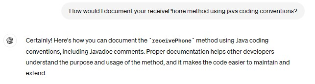

# Kanban Board

# ChatGPT

## Domain Model From User Story

## Identifying Tests

## Identifying Edge Cases

## Identifying Corner Cases

## Writing Tests

## Refactoring Code

## Documenting Code

